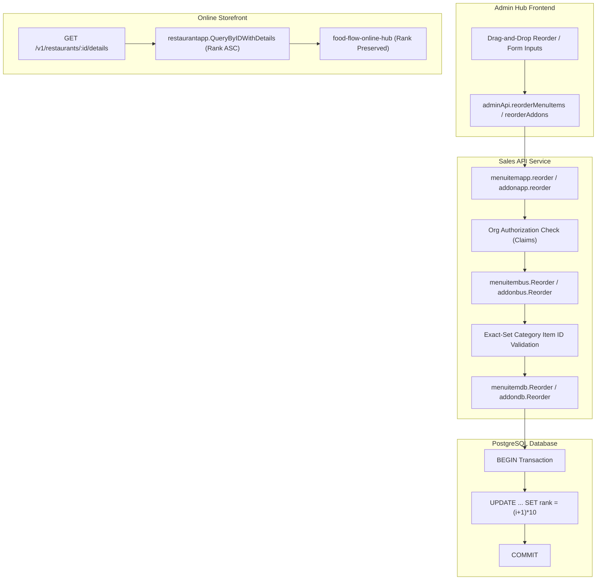
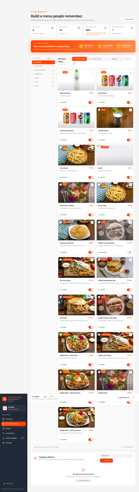
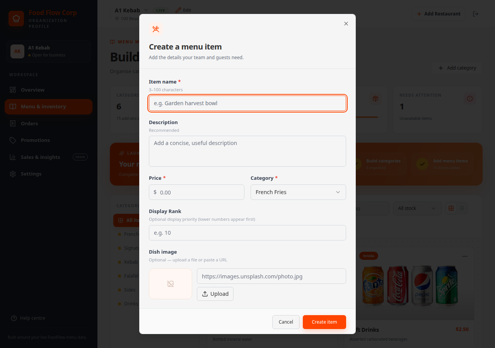
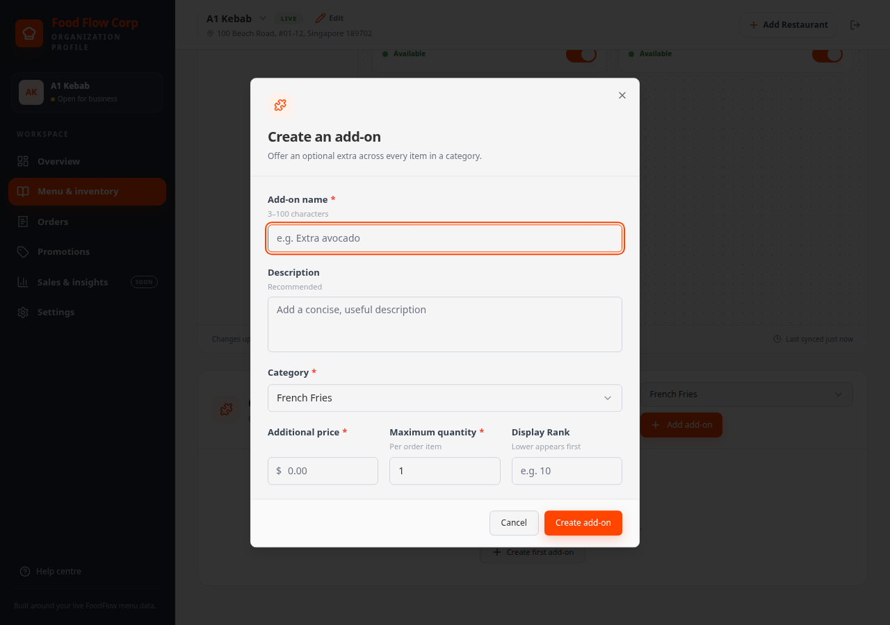
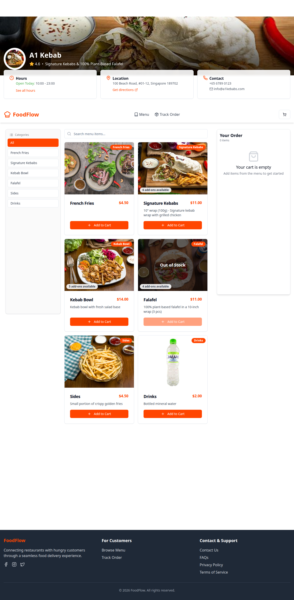
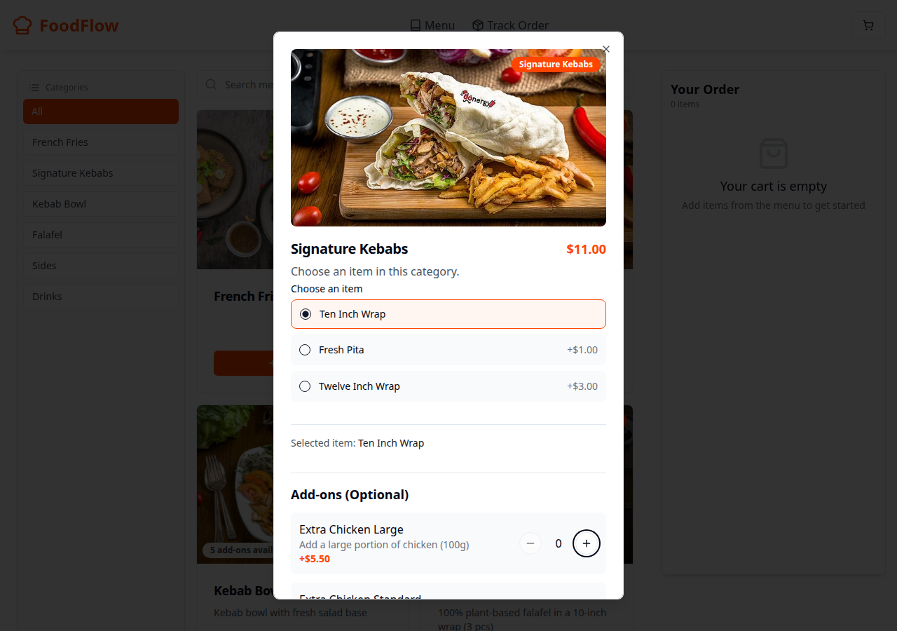

# Verification & Implementation Report: Menu Item & Add-on Display Rank

- **Feature**: Rank-Based Display Ordering for Menu Items and Add-Ons
- **Specification**: [`docs/specs/menu-item-addon-rank.md`](../specs/menu-item-addon-rank.md)
- **Branch**: `feat/menu-addon-rank`
- **Date**: 2026-08-21
- **Status**: **Completed & Verified**

---

## 1. Executive Summary

This feature delivers end-to-end custom display ordering (`rank`) for menu items and category-scoped add-ons across all tiers of the Food Flow microservices stack. Restaurant operators can now customize and prioritize the display sequence of dishes and add-on options numerically or via drag-and-drop handles in the Admin Hub. The customer storefront consumes the rank-sorted restaurant details API and presents items in the operator's designated sequence.

---

## 2. Architecture & Data Flow

---

## 3. Implementation Checklist & Field Mapping

Following the workspace field mapping guidelines from `.agents/AGENTS.md`:

| Tier | Component / File | Description |
| :--- | :--- | :--- |
| **1. Database Schema** | `business/sdk/migrate/sql/migrate.sql` | Migration `1.22` adding `rank INT` (nullable) to `menu_items` and `addons`. |
| **1. Database Seeds** | `business/sdk/migrate/sql/seed.sql` | Seeded sequential ranks (`10, 20, 30...`) and `NULL`s for testing. |
| **2. DB Store Layer** | `business/domain/menuitembus/stores/menuitemdb/` | `menuItem` model mapping, `INSERT`/`UPDATE`/`SELECT` columns, `OrderByRank`, transactional `Reorder`. |
| **2. DB Store Layer** | `business/domain/addonbus/stores/addondb/` | `dbAddon` model mapping, `INSERT`/`UPDATE`/`SELECT` columns, `OrderByRank`, `QueryByCategoryID` ordering, transactional `Reorder`. |
| **3. Business Domain** | `business/domain/menuitembus/` | `MenuItem`, `NewMenuItem`, `UpdateMenuItem` models, `Create`, `Update`, and `Reorder` with exact-set verification. |
| **3. Business Domain** | `business/domain/addonbus/` | `Addon`, `NewAddon`, `UpdateAddon` models, `Create`, `Update`, and `Reorder` with exact-set verification. |
| **4. API / Application** | `app/domain/menuitemapp/` | DTOs, `ToAppMenuItem`, `PUT /v1/menuitems/order` with org claims check. |
| **4. API / Application** | `app/domain/addonapp/` | DTOs, `ToAppAddon`, `PUT /v1/addons/order` with org claims check. |
| **4. API / Application** | `app/domain/restaurantapp/` | `QueryByIDWithDetails` orders menu items and addons by `rank` (with price/name tiebreakers). |
| **5. Admin Hub** | `api/frontends/food-flow-admin-hub/` | API client methods, `Display Rank` numeric inputs, HTML5 drag-and-drop handles (`GripVertical`), optimistic UI updates, rank badges. |
| **6. Online Storefront** | `api/frontends/food-flow-online-hub/` | Domain types, `transformers.ts` mapping and documentation for rank-preservation. |

---

## 4. Commit History (`feat/menu-addon-rank`)

All commits follow the Conventional Commits specification, are atomic, self-contained, and contain no AI attributions:

1. `d8a434a` - `feat(menu): add rank columns to menu_items and addons schema and seeds`
2. `7eeb468` - `feat(menuitem): add rank and reorder to business domain and store layer`
3. `0efc6f6` - `feat(addon): add rank and reorder to business domain and store layer`
4. `2ad9aa9` - `feat(api): expose rank and reorder endpoints, order details by rank`
5. `5045f76` - `feat(admin-hub): add display-rank input and rank-ordered item and addon lists`
6. `e326ac9` - `feat(admin-hub): add drag-and-drop reordering for items and addons`
7. `06d62b4` - `docs(storefront): update ordering comments and types for rank-aware menu order`
8. `def4eff` - `fix(db): correct UUID format typo for beef kebab item in seed.sql`

---

## 5. Test Coverage & Verification Results

### 5.1 Backend Unit & Integration Tests
All backend test packages pass with clean cache (`go test -count=1 ./...`):
- `menuitembus` and `addonbus` unit tests (create with rank, update rank, preserve rank, transactional reorder).
- `menuitemapi` and `addonapi` integration tests (`reorder200`, `reorder400` set mismatch/invalid UUIDs, `reorder401` authentication/org permission denial).
- `restaurantapi` details test verifying rank sorting and stable tiebreaking.

### 5.2 Frontend Production Builds
- `food-flow-admin-hub`: `tsc -b && vite build` passed with zero errors.
- `food-flow-online-hub`: `tsc -b && vite build` passed with zero errors.

### 5.3 Automated Browser UI Tests (Playwright)
Playwright browser automation was executed against the active Kind Kubernetes cluster (`http://localhost:8080` Storefront and `http://localhost:8081` Admin Hub):
- Verified operator login (`admin@example.com`).
- Verified presence and styling of Display Rank inputs in creation/editing modals.
- Verified drag handles and category add-on management.
- Verified customer storefront rendering and add-on option display in rank-sorted sequence.

---

## 6. Visual Verification Gallery

### 6.1 Admin Hub - Menu Workspace & Reordering Affordances
Drag handles (`GripVertical`), Category Add-ons management section, and display order cards.

---

### 6.2 Admin Hub - Create Menu Item Modal with Display Rank
Display Rank input field (`input#rank`) with helper text for operator ordering.

---

### 6.3 Admin Hub - Create Add-on Modal with Display Rank
Display Rank input field integrated into the Add-on creation dialog.

---

### 6.4 Storefront - Restaurant Details & Ranked Menu Items
Customer storefront (`http://localhost:8080/restaurant/...`) presenting ranked categories and dishes.

---

### 6.5 Storefront - Item Detail & Ranked Add-ons Selection Dialog
Item customization dialog displaying category add-on options in rank-prioritized order.

---

## 7. Security & Edge Case Handling

1. **Multi-Tenant / Org Security**:
   - `PUT /v1/menuitems/order` and `PUT /v1/addons/order` resolve the category's restaurant and assert `claims.IsOrgAuthorized(rest.OrganizationID)`.
2. **Exact-Set Validation**:
   - Reordering requires the payload `orderedIds` to match the exact set of existing IDs in the category. Subsets, extra IDs, or foreign category IDs return `400 Bad Request`.
3. **Transaction Safety**:
   - `Reorder` runs within an atomic PostgreSQL transaction (`BeginTxx`), preventing partial updates.
4. **Graceful Unranked Fallback**:
   - Unranked items (`rank IS NULL`) sort after ranked entries and maintain stable price/name/ID ordering.
