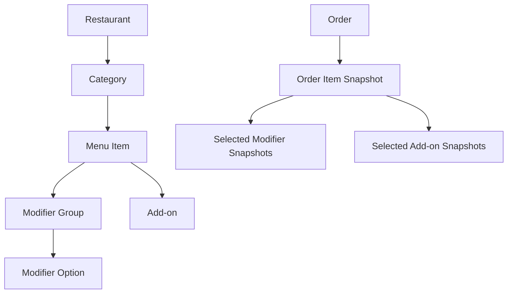

# Spec: Menu Hierarchy Reorganization and Modifier Domain Model

- **Status**: Draft, pending product and engineering approval
- **Last updated**: 2026-09-02
- **Implementation branch**: `feat/menu-hierarchy-and-modifiers`
- **Spec location**: `docs/specs/menu-hierarchy-and-modifiers.md`
- **Depends on**:
  - the rank support already present for menu items and add-ons;
  - the expanded name-validation work if seeded names use `+`, `&`, or parentheses;
  - organization authorization already used by catalog write handlers.
- **Scope**: schema and seeds, category/menu-item/add-on/modifier/order domains, Sales API, admin hub, customer storefront, analytics, tests, deployment, and staging database rebuild.

---

## 1. Executive Summary

Food Flow currently models sellable variants as sibling menu items under a category. For example, `Kebab Roll` is a category while `Chicken Kebab Roll`, `Beef Kebab Roll`, and `Mix Kebab Roll` are menu items. The storefront compensates by showing one representative category card and treating sibling menu items as radio options.

This feature replaces that inversion with a conventional hierarchy:



Examples:

- Category: `Mains`
- Menu item: `Kebab Roll`, base price `$11.00`
- Modifier group: `Choose a protein`, required, exactly one selection
- Modifier options: `Chicken +$0.00`, `Beef +$1.00`, `Mix +$2.50`
- Add-ons: `Extra Cheese +$2.00`, `Garlic Sauce +$1.00`

The server remains authoritative for availability, ownership, selection validity, and price. Clients send catalog IDs and quantities only. Orders preserve names and prices as immutable snapshots.

Food Flow is not yet in production, so this feature uses one coordinated schema and client cutover. The Darwin history is squashed into a single `Version: 1.01` baseline, local/test/staging databases are rebuilt from that baseline, and no restaurant-level menu-version marker or legacy menu behavior is retained.

---

## 2. Current State and Confirmed Problems

The design is grounded in the current repository rather than an assumed greenfield model.

| Area | Current behavior | Problem |
|---|---|---|
| Schema | `categories` has no rank; `addons` belongs to a category; no modifier tables | Cannot rank real sections or attach an add-on to specific items |
| Seed data | Dish families are categories and variants are menu items | Domain hierarchy is inverted |
| Restaurant details | Category JSON uses the misspelled key `mentuItems`; category add-ons are copied onto every item | Public contract encodes the workaround |
| Desktop storefront | `MenuGrid` renders one representative card per category | Individual dishes are not first-class cards |
| Mobile storefront | `MobileRestaurant` repeats the representative-card behavior | Desktop and mobile must both be migrated |
| Item dialog | Sibling menu items are rendered as variant radio choices | Variants cannot be reused or grouped independently |
| Cart/order request | Items contain `menuItemId`, quantity, instructions, and add-ons only | No modifier selection can reach checkout |
| Order snapshots | Menu-item and add-on names/prices are snapshotted | Modifier snapshots and deletion-safe references are absent |
| Analytics | Item revenue sums `menu_item_price * quantity` | Modifier revenue would be omitted unless formulas change |
| Admin hub | Categories, menu items, and category add-ons can be managed; menu items/add-ons can be reordered | No category ordering, modifier management, or item-level add-on assignment |

---

## 3. Goals, Non-Goals, and Success Measures

### 3.1 Goals

1. Model a restaurant menu as category → menu item → modifier groups/options and add-ons.
2. Display every menu item as its own storefront card on desktop and mobile.
3. Support zero or more modifier groups on a menu item. In v1, each group permits zero or one selected option.
4. Attach reusable add-on definitions to explicit menu items.
5. Make all selection and price validation server-authoritative.
6. Preserve historical names and prices after catalog edits or deletion.
7. Add category, modifier-group, modifier-option, and item-add-on ordering with deterministic tie-breaks.
8. Keep organization boundaries intact in schema constraints and API authorization.
9. Maintain exact subtotal, discount, tax, total, receipt, and analytics consistency.
10. Provide a coordinated pre-production rebuild and deployment plan with explicit rollback boundaries.

### 3.2 Non-goals for v1

- Multi-select modifier groups such as “choose up to three toppings.” The schema can evolve to this, but v1 group cardinality is `minSelections ∈ {0,1}` and `maxSelections = 1`.
- Conditional options, nested modifiers, option-dependent add-ons, bundles, combo builders, inventory depletion, or time-based availability.
- Per-option images, nutrition, allergens, localization, or per-location pricing.
- Currency migration. Existing APIs continue to expose numeric amounts and existing restaurant currency presentation remains unchanged.
- Preserving current local or staging catalog/order rows through an in-place migration. Those databases are rebuilt from the final schema and deterministic seed data.
- Redesigning unrelated marketing, checkout, payment, or order-status flows.

### 3.3 Success measures

- Storefront categories are real sections such as Mains, Sides, Desserts, and Drinks.
- A configured item can be ordered with valid modifiers and add-ons from both checkout variants.
- A stale or malicious client cannot submit an option/add-on from another item or restaurant, an unavailable selection, a duplicate add-on, or client-supplied prices.
- The same hand-calculated order subtotal is returned by the API, displayed by both frontends, persisted in the database, and represented in item analytics.
- Orders created under the rebuilt schema remain readable after the related catalog records are removed.

---

## 4. Terminology and Domain Invariants

| Term | Definition |
|---|---|
| Base price | The menu item price before modifier deltas and add-ons |
| Modifier group | A named selection question attached to a menu item, for example `Choose a protein` |
| Modifier option | One selectable answer in a group, for example `Beef +$1.00` |
| Price delta | An amount added to the menu-item base price; never an override |
| Add-on | An independently quantified optional extra attached to one or more menu items |
| Snapshot | Name and price copied into an order at creation time and never subsequently derived from the catalog |

Required invariants:

1. A category, menu item, group, option, and add-on association must resolve to the same restaurant.
2. A modifier option belongs to exactly one group; a group belongs to exactly one menu item.
3. A menu item may have no groups. If it has a required group, exactly one available option from that group must be submitted.
4. An optional group accepts zero or one option.
5. An option from one group cannot satisfy another group.
6. An add-on is valid only when an active `menu_item_addons` association exists for the ordered menu item.
7. Duplicate modifier-group selections and duplicate add-on IDs in one order item are invalid, rather than merged.
8. Menu-item base prices are greater than zero; modifier deltas and add-on prices are non-negative; configured display ranks use positive integers.
9. Deleting or disabling a catalog entity never changes an existing order snapshot.
10. The API never accepts menu-item, option, add-on, subtotal, tax, discount, or total prices from the customer.

---

## 5. Chosen Design and Alternatives

### 5.1 Modifier groups plus options, not a flat modifier table

A flat `modifiers(menu_item_id, name, price)` table can represent only one implicit choice set and cannot distinguish:

- a required protein choice from an optional size choice;
- one selection in each of two groups;
- group-level labels, instructions, ordering, or cardinality.

The chosen model uses `modifier_groups` and `modifier_options`. V1 still limits each group to one selected option, but it does not limit an item to one group.

### 5.2 Add-on definitions plus explicit menu-item associations

Adding nullable `menu_item_id` directly to `addons` while retaining non-null `category_id` creates two owners and undefined fallback behavior. It also forces duplicate add-on rows when the same extra applies to several menu items.

The chosen model:

- keeps `addons` as restaurant-owned definitions;
- introduces `menu_item_addons` as the explicit many-to-many applicability relation;
- has no category-owned add-on column or runtime fallback;
- keeps price and `max_quantity` on the add-on definition;
- keeps display rank on the menu-item association so the same add-on can appear in a different position on different items.

An add-on associated with multiple items therefore has the same price and maximum quantity on each item. Per-item overrides are deferred.

### 5.3 Delta pricing

`modifier_options.price_delta` is always additive:

```text
unit price = menu item base price
           + Σ selected modifier option price deltas
           + Σ(add-on unit price × add-on quantity)

line total = unit price × menu-item quantity
```

Override pricing is rejected because mixing delta and absolute prices is error-prone in APIs, receipts, and analytics.

---

## 6. Database Design

Because Food Flow has not entered production and staging can be rebuilt, rewrite `business/sdk/migrate/sql/migrate.sql` as one clean Darwin baseline:

```sql
-- Version: 1.01
-- Description: Create Food Flow schema
```

All table, constraint, and index definitions in this section belong to that single migration block and must be ordered by dependency. Fold fields that were previously added by `ALTER TABLE` into their owning `CREATE TABLE` statements. Do not append versions `1.25+`, preserve transitional columns, or add data backfills/cleanup migrations for the old hierarchy.

`business/sdk/migrate/sql/seed.sql` must likewise describe only the final menu hierarchy. Existing local, test, and staging databases must be dropped and recreated before running the rewritten baseline; an already initialized Darwin database must not run against the rewritten `1.01` history.

### 6.1 Category rank and tenant-consistent parent keys

```sql
CREATE TABLE categories (
    category_id   UUID      NOT NULL,
    name          TEXT      NOT NULL,
    description   TEXT      NULL,
    restaurant_id UUID      NOT NULL,
    enabled       BOOLEAN   NOT NULL,
    rank          INT       NULL,
    date_created  TIMESTAMP NOT NULL,
    date_updated  TIMESTAMP NOT NULL,

    PRIMARY KEY (category_id),
    CONSTRAINT categories_id_restaurant_unique
        UNIQUE (category_id, restaurant_id),
    FOREIGN KEY (restaurant_id)
        REFERENCES restaurants(restaurant_id)
        ON DELETE CASCADE,
    CONSTRAINT categories_rank_check
        CHECK (rank IS NULL OR rank >= 1)
);

CREATE TABLE menu_items (
    menu_item_id  UUID           NOT NULL,
    name          TEXT           NOT NULL,
    description   TEXT           NULL,
    price         NUMERIC(10, 2) NOT NULL,
    category_id   UUID           NOT NULL,
    restaurant_id UUID           NOT NULL,
    image_url     TEXT           NULL,
    available     BOOLEAN        NOT NULL,
    rank          INT            NULL,
    date_created  TIMESTAMP      NOT NULL,
    date_updated  TIMESTAMP      NOT NULL,

    PRIMARY KEY (menu_item_id),
    CONSTRAINT menu_items_id_restaurant_unique
        UNIQUE (menu_item_id, restaurant_id),
    CONSTRAINT menu_items_category_restaurant_fkey
        FOREIGN KEY (category_id, restaurant_id)
        REFERENCES categories(category_id, restaurant_id)
        ON DELETE CASCADE,
    FOREIGN KEY (restaurant_id)
        REFERENCES restaurants(restaurant_id)
        ON DELETE CASCADE,
    CONSTRAINT menu_items_price_check
        CHECK (price > 0),
    CONSTRAINT menu_items_rank_check
        CHECK (rank IS NULL OR rank >= 1)
);

CREATE INDEX idx_categories_restaurant_rank
    ON categories(restaurant_id, rank, name, category_id);
```

The final seed and schema-verification tests must prove that every menu item references a category from the same restaurant and that no menu item has `price <= 0`.

### 6.2 Modifier groups

```sql
CREATE TABLE modifier_groups (
    modifier_group_id UUID      NOT NULL,
    menu_item_id      UUID      NOT NULL,
    restaurant_id     UUID      NOT NULL,
    name              TEXT      NOT NULL,
    description       TEXT      NULL,
    min_selections    INT       NOT NULL DEFAULT 1,
    max_selections    INT       NOT NULL DEFAULT 1,
    available         BOOLEAN   NOT NULL DEFAULT false,
    rank              INT       NULL,
    date_created      TIMESTAMP NOT NULL,
    date_updated      TIMESTAMP NOT NULL,

    PRIMARY KEY (modifier_group_id),
    UNIQUE (modifier_group_id, restaurant_id),
    FOREIGN KEY (menu_item_id, restaurant_id)
        REFERENCES menu_items(menu_item_id, restaurant_id)
        ON DELETE CASCADE,
    CHECK (min_selections IN (0, 1)),
    CHECK (max_selections = 1),
    CHECK (min_selections <= max_selections),
    CHECK (rank IS NULL OR rank >= 1)
);

CREATE UNIQUE INDEX idx_modifier_groups_unique_name
    ON modifier_groups(menu_item_id, lower(name));
CREATE INDEX idx_modifier_groups_menu_item_rank
    ON modifier_groups(menu_item_id, rank, name, modifier_group_id);
CREATE INDEX idx_modifier_groups_restaurant
    ON modifier_groups(restaurant_id);
```

`available=false` disables the entire group. A disabled required group does not make the item unorderable and requires no selection. Groups default to disabled so an admin can create the group, add options, and then enable it without temporarily publishing an invalid required group.

### 6.3 Modifier options

```sql
CREATE TABLE modifier_options (
    modifier_option_id UUID           NOT NULL,
    modifier_group_id  UUID           NOT NULL,
    restaurant_id      UUID           NOT NULL,
    name               TEXT           NOT NULL,
    description        TEXT           NULL,
    price_delta        NUMERIC(10, 2) NOT NULL DEFAULT 0.00,
    available          BOOLEAN        NOT NULL DEFAULT true,
    rank               INT            NULL,
    date_created       TIMESTAMP      NOT NULL,
    date_updated       TIMESTAMP      NOT NULL,

    PRIMARY KEY (modifier_option_id),
    UNIQUE (modifier_option_id, restaurant_id),
    FOREIGN KEY (modifier_group_id, restaurant_id)
        REFERENCES modifier_groups(modifier_group_id, restaurant_id)
        ON DELETE CASCADE,
    CHECK (price_delta >= 0),
    CHECK (rank IS NULL OR rank >= 1)
);

CREATE UNIQUE INDEX idx_modifier_options_unique_name
    ON modifier_options(modifier_group_id, lower(name));
CREATE INDEX idx_modifier_options_group_rank
    ON modifier_options(modifier_group_id, rank, name, modifier_option_id);
CREATE INDEX idx_modifier_options_restaurant
    ON modifier_options(restaurant_id);
```

Zero-price options are valid and must not be blocked by a `required` validator on the numeric field.

### 6.4 Item-level add-on associations

```sql
CREATE TABLE addons (
    addon_id      UUID           NOT NULL,
    restaurant_id UUID           NOT NULL,
    name          TEXT           NOT NULL,
    description   TEXT           NULL,
    price         NUMERIC(10, 2) NOT NULL,
    available     BOOLEAN        NOT NULL DEFAULT true,
    max_quantity  INT            NOT NULL DEFAULT 10,
    date_created  TIMESTAMP      NOT NULL,
    date_updated  TIMESTAMP      NOT NULL,

    PRIMARY KEY (addon_id),
    CONSTRAINT addons_id_restaurant_unique
        UNIQUE (addon_id, restaurant_id),
    FOREIGN KEY (restaurant_id)
        REFERENCES restaurants(restaurant_id)
        ON DELETE CASCADE,
    CONSTRAINT addons_price_check
        CHECK (price >= 0),
    CONSTRAINT addons_max_quantity_check
        CHECK (max_quantity >= 1)
);

CREATE TABLE menu_item_addons (
    menu_item_id  UUID      NOT NULL,
    addon_id      UUID      NOT NULL,
    restaurant_id UUID      NOT NULL,
    rank          INT       NULL,
    date_created  TIMESTAMP NOT NULL,

    PRIMARY KEY (menu_item_id, addon_id),
    FOREIGN KEY (menu_item_id, restaurant_id)
        REFERENCES menu_items(menu_item_id, restaurant_id)
        ON DELETE CASCADE,
    FOREIGN KEY (addon_id, restaurant_id)
        REFERENCES addons(addon_id, restaurant_id)
        ON DELETE CASCADE,
    CHECK (rank IS NULL OR rank >= 1)
);

CREATE INDEX idx_menu_item_addons_item_rank
    ON menu_item_addons(menu_item_id, rank, addon_id);
CREATE INDEX idx_menu_item_addons_addon
    ON menu_item_addons(addon_id);
CREATE INDEX idx_addons_restaurant
    ON addons(restaurant_id);
```

The baseline `addons` table has no `category_id` or definition-level `rank`. Seed data creates each restaurant-owned add-on once and inserts only its intended item associations, including the per-item rank. Runtime code reads applicability exclusively from `menu_item_addons`.

### 6.5 Order snapshots and deletion-safe references

One order item may contain one selected option from each of several groups, so selected modifiers require a child table.

```sql
CREATE TABLE order_items (
    order_item_id        UUID           NOT NULL,
    order_id             UUID           NOT NULL,
    category_id          UUID           NOT NULL,
    category_name        TEXT           NOT NULL,
    menu_item_id         UUID           NOT NULL,
    menu_item_name       TEXT           NOT NULL,
    menu_item_price      NUMERIC(10, 2) NOT NULL,
    quantity             INT            NOT NULL,
    special_instructions TEXT           NULL,
    date_created         TIMESTAMP      NOT NULL,

    PRIMARY KEY (order_item_id),
    FOREIGN KEY (order_id)
        REFERENCES orders(order_id)
        ON DELETE CASCADE
);

CREATE TABLE order_item_addons (
    order_item_addon_id UUID           NOT NULL,
    order_item_id       UUID           NOT NULL,
    addon_id            UUID           NOT NULL,
    addon_name          TEXT           NOT NULL,
    addon_price         NUMERIC(10, 2) NOT NULL,
    quantity            INT            NOT NULL,
    date_created        TIMESTAMP      NOT NULL,

    PRIMARY KEY (order_item_addon_id),
    FOREIGN KEY (order_item_id)
        REFERENCES order_items(order_item_id)
        ON DELETE CASCADE
);

CREATE TABLE order_item_modifiers (
    order_item_modifier_id UUID           NOT NULL,
    order_item_id          UUID           NOT NULL,
    modifier_group_id      UUID           NOT NULL,
    modifier_group_name    TEXT           NOT NULL,
    modifier_option_id     UUID           NOT NULL,
    modifier_option_name   TEXT           NOT NULL,
    price_delta            NUMERIC(10, 2) NOT NULL,
    date_created           TIMESTAMP      NOT NULL,

    PRIMARY KEY (order_item_modifier_id),
    UNIQUE (order_item_id, modifier_group_id),
    FOREIGN KEY (order_item_id)
        REFERENCES order_items(order_item_id)
        ON DELETE CASCADE,
    CHECK (price_delta >= 0)
);

CREATE INDEX idx_order_item_modifiers_order_item
    ON order_item_modifiers(order_item_id);
CREATE INDEX idx_order_item_modifiers_option
    ON order_item_modifiers(modifier_option_id);
```

Historical snapshots must survive catalog deletion. Catalog IDs in order tables are immutable source identifiers captured at purchase time, not live foreign keys. The clean baseline therefore creates order snapshot tables without foreign keys to menu items, modifier groups/options, or add-ons.

Consequences that must be mapped through Go and JSON:

- historical `menuItemId`, `addonId`, `modifierGroupId`, and `modifierOptionId` remain stable but may no longer resolve through catalog endpoints;
- category ID/name, item name/price, modifier group/option names/deltas, and add-on names/prices are non-null snapshots;
- receipts render snapshots and never dereference the current catalog.

Seeded orders must contain complete category, item, modifier, and add-on snapshots from their initial insert; there is no backfill path for pre-rebuild order rows.

### 6.6 Ordering semantics

All rank fields are nullable positive integers:

| Entity | Ordering |
|---|---|
| Categories in details | rank ASC NULLS LAST, name ASC, category_id ASC |
| Menu items in a category | rank ASC NULLS LAST, price ASC, name ASC, menu_item_id ASC |
| Modifier groups | rank ASC NULLS LAST, name ASC, modifier_group_id ASC |
| Modifier options | rank ASC NULLS LAST, name ASC, modifier_option_id ASC |
| Add-ons for an item | association rank ASC NULLS LAST, name ASC, addon_id ASC |

Duplicate ranks are allowed. Reorder endpoints atomically renumber exact sets as `10, 20, 30, ...`, following the existing menu-item/add-on reorder convention.

Rank updates must distinguish three states:

- field omitted: leave unchanged;
- positive integer: set rank;
- explicit JSON `null`: clear rank.

Use a small optional-nullable integer DTO with `Present bool` and `Value *int` plus custom JSON decoding, then map it to explicit business update semantics. A plain `*int` is insufficient because omitted and JSON `null` collapse to the same Go value. Add decoder, set, clear, and omit tests for category, menu-item, group, and option rank updates.

### 6.7 Schema verification queries

Baseline schema and seed verification must fail if any query returns rows:

- menu item whose category has a different restaurant;
- modifier group/option with mismatched restaurant;
- menu-item add-on association with mismatched restaurant;
- active required group with no available options (this state is rejected by normal writes and treated as deployment-invalid);
- negative prices, invalid cardinalities, or invalid ranks;
- orphaned order snapshot rows.

---

## 7. Seed and Database Rebuild

### 7.1 Rebuild policy

`seed.sql` currently uses `ON CONFLICT DO NOTHING`; changing existing rows does not update a previously seeded database. Therefore:

- the implementation rewrites `migrate.sql` into the single final `Version: 1.01` baseline described in §6;
- `seed.sql` contains only the final hierarchy and complete final order snapshots;
- local, test, and staging databases using the old migration history are dropped and recreated rather than upgraded in place;
- rebuilding intentionally discards existing demo catalog and order rows;
- any staging data worth retaining must be backed up separately before the rebuild, but transforming that data is outside this pre-production feature.

### 7.2 Deterministic seed mapping

Both Donergy and A1 Kebab must be rewritten in the final seed, not only the example items. The implementation PR must include a checked mapping table in its description or a companion local artifact containing:

```text
old category ID
old menu-item ID
new category ID
new menu-item ID
new modifier-group ID, if any
new modifier-option ID, if any
base price
price delta
add-on associations
```

Rules:

1. Choose the lowest valid variant price as the base price when sibling variants become options.
2. Set each option delta to `old variant price - new base price`.
3. Keep genuinely distinct products as separate menu items, not options merely because they shared a category.
4. Preserve the best representative image on the new base menu item.
5. Convert category-owned add-ons to explicit item associations.
6. Use stable UUIDs so tests and walkthroughs are deterministic.
7. Update seeded order snapshots and totals to the new snapshot model; do not silently reinterpret historical variant IDs.
8. Recalculate seeded subtotal, discount, tax, delivery fee, and total and assert their exact values.

Target high-level categories:

| Restaurant | Required category families |
|---|---|
| Donergy | Mains; Vegetarian; Appetizers and Sides; Desserts; Drinks |
| A1 Kebab | Mains; Plant Based; Sides; Drinks |

Final naming and grouping require product approval because categorizing a sellable product versus an option is a business decision.

### 7.3 Example final hierarchy

```text
Category: Mains, rank 10
  Menu item: Kebab Roll, base $11.00, rank 10
    Group: Choose a protein, required, rank 10
      Chicken +$0.00, rank 10
      Beef +$1.00, rank 20
      Mix +$2.50, rank 30
    Add-ons:
      Extra Cheese +$2.00, max 3
      Extra Meat +$4.00, max 2
      Garlic Sauce +$1.00, max 3
```

Names must comply with the `business/types/name` rule on the implementation branch. Details such as weights and serving sizes belong in descriptions if a target environment has not yet received expanded punctuation support.

### 7.4 Staging rebuild procedure

1. Back up the staging database if its current demo data is useful for reference.
2. Stop or scale down the staging API so it cannot write during the reset.
3. Drop and recreate the staging database.
4. Run the squashed `Version: 1.01` schema and final `seed.sql`.
5. Run schema-verification queries and exact seeded-order reconciliation.
6. Deploy the backend and both frontends built for the new hierarchy.
7. Run the acceptance smoke tests before reopening staging.

Do not run the rewritten migration history against the existing staging database and do not copy old catalog/order rows into the new schema.

### 7.5 Single menu contract

Do not add `restaurants.menu_model_version` or expose `menuModelVersion` through the API. After the rebuild:

- every restaurant uses the category → menu item → modifier group/option hierarchy;
- restaurant details return only the new hierarchy;
- desktop and mobile storefronts render only the new individual-item flow;
- the admin hub manages only restaurant-owned add-ons and explicit item associations;
- no runtime branch, category-add-on fallback, or cleanup migration preserves the old menu model.

The cart payload may still use its own client-storage schema version so malformed or pre-feature local data can be discarded. That client-only version is unrelated to restaurants and must not select between menu domain models.

---

## 8. Backend Domain and Store Implementation

Follow the repository end-to-end field-mapping checklist for every new or changed field.

### 8.1 New domains

Create:

```text
business/domain/modifiergroupbus/
business/domain/modifiergroupbus/stores/modifiergroupdb/
business/domain/modifieroptionbus/
business/domain/modifieroptionbus/stores/modifieroptiondb/
app/domain/modifiergroupapp/
app/domain/modifieroptionapp/
```

Each business domain includes:

- entity, `New*`, and `Update*` models;
- `Storer` interface;
- `Create`, `Update`, `Delete`, `Query`, `Count`, `QueryByID`, and parent-scoped query operations;
- filter and order-by definitions;
- test utilities and store-backed business tests;
- complete create/update assignment of every field.

The option domain may depend on group lookup for parent validation; the order domain depends on both.

### 8.2 Existing domains

#### `categorybus`

- Add `Rank *int` to entity/new/update/store/app models and converters.
- Add rank ordering and a transactional `Reorder` operation.
- Add `PUT /v1/categories/order`.
- Validate category and restaurant organization ownership.

#### `menuitembus`

- Continue treating `Price` as base price.
- Provide efficient query methods used by details aggregation.
- Enforce category and menu-item restaurant consistency on create and category move.
- Reject order creation for `Available=false`.

#### `addonbus`

- Remove category ownership from the final model.
- Add item-association store operations: assign, unassign, list by item, replace an exact set, and reorder an exact set.
- Create/update validates restaurant ownership; assign validates that item and add-on share the restaurant.
- Preserve zero-price add-ons and `MaxQuantity >= 1`.

#### `orderbus`

Add:

```go
type NewOrderItem struct {
    MenuItemID          string
    Quantity            int
    SpecialInstructions string
    Modifiers           []NewOrderItemModifier
    Addons              []NewOrderItemAddon
}

type NewOrderItemModifier struct {
    ModifierGroupID  string
    ModifierOptionID string
}
```

`OrderItem` receives `CategoryID`, `CategoryName`, and `Modifiers []OrderItemModifierSnapshot`. Historical catalog IDs remain non-null source identifiers but are not assumed to resolve after deletion.

### 8.3 Order creation validation algorithm

For each requested line, before persisting anything:

1. Parse IDs and validate menu-item quantity.
2. Load the menu item and verify restaurant ownership and `available=true`.
3. Load all active required groups plus every submitted group and option in one bounded query, including unavailable submitted records so not-found, foreign, and unavailable cases remain distinguishable.
4. Reject duplicate submitted group IDs.
5. For every available required group, require exactly one submitted option.
6. For optional groups, accept zero or one option.
7. Reject a disabled group, disabled option, option from another group, group from another item, or cross-restaurant selection.
8. Load submitted add-ons and associations in one bounded query.
9. Reject duplicate add-on IDs, unavailable add-ons, missing item associations, cross-restaurant add-ons, and quantities outside `1..maxQuantity`.
10. Snapshot all names and prices.
11. Calculate the line subtotal from server-loaded amounts.

Only after all lines pass does the order store write the order, items, modifier snapshots, add-on snapshots, and delivery address in one database transaction. A failed validation or write leaves no partial order.

### 8.4 Money and rounding

All tiers must implement the same rules:

1. Database amounts use `NUMERIC(10,2)` and therefore permit `0.00..99,999,999.99`.
2. Change `money.Parse` and all affected API validation to enforce the same maximum; menu-item base price must also be greater than zero.
3. Calculate from server-owned values.
4. Round monetary outputs to two decimal places at the same boundaries currently used by order creation.
5. Compute:

```text
line = quantity × (
    base price
    + sum(option deltas)
    + sum(add-on price × add-on quantity)
)

subtotal = round2(sum(lines))
discount = existing promotion rule applied to subtotal
taxable subtotal = max(0, subtotal - discount)
tax = existing restaurant tax rule applied to taxable subtotal
total = round2(taxable subtotal + tax + delivery fee)
```

No frontend calculation is authoritative. The order response and payment intent use the persisted server total.

If any intermediate or final amount exceeds `99,999,999.99`, order creation returns a domain validation error before persistence. Tests cover the exact maximum and one-cent-over boundary.

### 8.5 Analytics

Update both top-item and all-item sales queries:

```text
item revenue =
  quantity × (
    menu_item_price
    + sum(order_item_modifiers.price_delta)
    + sum(order_item_addons.addon_price × order_item_addons.quantity)
  )
```

Avoid joining both child tables in a way that creates a modifier × add-on Cartesian product. Aggregate each child table by `order_item_id` in separate CTEs/subqueries before joining.

Grouping remains by immutable menu-item source ID/name. Category attribution uses `order_items.category_id` and `category_name` snapshots, never a current-catalog lookup. Add tests proving:

- option revenue is included once;
- add-on revenue is included once;
- multiple modifiers and add-ons do not multiply each other;
- item revenue reconciles exactly with qualifying order line subtotals;
- existing order-status filters remain unchanged.

### 8.6 Dependency wiring

The implementation is incomplete until new businesses are wired through:

- `api/services/sales/main.go` stores and business construction;
- `orderbus.NewBusiness`;
- `app/sdk/mux.BusConfig`;
- `api/services/sales/build/all/all.go`;
- restaurant details app configuration;
- `business/sdk/dbtest` domain/test construction;
- API seed helpers and test setup.

---

## 9. REST API Contract

### 9.1 Naming

- JSON uses camelCase.
- Filter query parameters use the repository's existing snake_case names, such
  as `restaurant_id`, `menu_item_id`, and `start_created_date`. Pagination and
  sorting retain the existing `page`, `rows`, and `orderBy` names; do not rename
  `orderBy` to `order_by`.
- List endpoints return the existing paginated `query.Result` envelope.
- Embedded collections always serialize as `[]`, never `null`.
- `mentuItems` is corrected to `menuItems`.

Because backend and clients are cut over together before production, the backend emits only `menuItems` and both frontends read only `menuItems`. Do not add a `mentuItems` fallback or emit both keys.

### 9.2 Public restaurant details

`GET /v1/restaurants/{restaurant_id}/details` remains the storefront aggregate:

```json
{
  "id": "restaurant-uuid",
  "name": "Donergy",
  "categories": [
    {
      "id": "category-uuid",
      "name": "Mains",
      "description": "Main dishes",
      "enabled": true,
      "rank": 10,
      "menuItems": [
        {
          "id": "item-uuid",
          "name": "Kebab Roll",
          "description": "Kebab wrapped in flatbread",
          "price": 11.00,
          "imageUrl": "https://example.invalid/kebab-roll.jpg",
          "available": true,
          "orderable": true,
          "rank": 10,
          "modifierGroups": [
            {
              "id": "group-uuid",
              "name": "Choose a protein",
              "description": "",
              "minSelections": 1,
              "maxSelections": 1,
              "available": true,
              "rank": 10,
              "options": [
                {
                  "id": "option-uuid",
                  "name": "Chicken",
                  "description": "",
                  "priceDelta": 0.00,
                  "available": true,
                  "rank": 10
                }
              ]
            }
          ],
          "addons": [
            {
              "id": "addon-uuid",
              "name": "Extra Cheese",
              "description": "",
              "price": 2.00,
              "available": true,
              "maxQuantity": 3,
              "rank": 10
            }
          ]
        }
      ]
    }
  ]
}
```

Public details behavior:

- omit disabled categories;
- include unavailable menu items so sold-out cards remain visible;
- include unavailable groups/options/add-ons with `available=false` so an open dialog can react to a refresh, but disable selection;
- `orderable` is false when the item is unavailable or any available required group has no available option;
- sort all levels per §6.6;
- use batched queries and in-memory grouping to avoid category × item × group N+1 queries;
- never duplicate category add-ons implicitly.

### 9.3 Admin catalog endpoints

Use existing auth conventions:

| Method and path | Purpose | Authorization |
|---|---|---|
| `GET /v1/modifiergroups` | Paginated list; filters include `restaurant_id`, `menu_item_id`, `available` | authenticated and organization-scoped |
| `GET /v1/modifiergroups/{id}` | Read one group | authenticated and organization-scoped |
| `POST /v1/modifiergroups` | Create | admin plus organization ownership |
| `PUT /v1/modifiergroups/{id}` | Partial update | admin plus organization ownership |
| `DELETE /v1/modifiergroups/{id}` | Delete | admin plus organization ownership |
| `PUT /v1/modifiergroups/order` | Exact-set reorder within a menu item | admin plus organization ownership |
| `GET /v1/modifieroptions` | Paginated list; filters include `restaurant_id`, `modifier_group_id`, `available` | authenticated and organization-scoped |
| `GET /v1/modifieroptions/{id}` | Read one option | authenticated and organization-scoped |
| `POST /v1/modifieroptions` | Create | admin plus organization ownership |
| `PUT /v1/modifieroptions/{id}` | Partial update | admin plus organization ownership |
| `DELETE /v1/modifieroptions/{id}` | Delete | admin plus organization ownership |
| `PUT /v1/modifieroptions/order` | Exact-set reorder within a group | admin plus organization ownership |
| `PUT /v1/categories/order` | Exact-set reorder within a restaurant | admin plus organization ownership |
| `GET /v1/menuitems/{id}/addons` | Read assigned add-ons with association rank | authenticated and organization-scoped |
| `PUT /v1/menuitems/{id}/addons` | Replace exact add-on association set | admin plus organization ownership |
| `PUT /v1/menuitems/{id}/addons/order` | Exact-set reorder of that item's assigned add-ons | admin plus organization ownership |

The existing category, menu-item, and refactored add-on list/by-ID endpoints receive the same organization-scoped read protection. A supplied `restaurant_id` filter is never treated as authorization.

Refactored add-on definition DTO:

```json
{
  "id": "addon-uuid",
  "restaurantId": "restaurant-uuid",
  "name": "Extra Cheese",
  "description": "Additional melted cheese",
  "price": 2.00,
  "available": true,
  "maxQuantity": 3,
  "dateCreated": "2026-08-27T00:00:00Z",
  "dateUpdated": "2026-08-27T00:00:00Z"
}
```

`categoryId` and definition-level `rank` are omitted from the add-on contract and do not exist in the rebuilt schema. `GET /v1/addons` supports `restaurant_id`, `available`, normal pagination, and allowed order fields `name`, `price`, `dateCreated`, and `dateUpdated`.

`GET /v1/menuitems/{id}/addons` returns `200` with the menu item's complete
embedded add-on array, including unavailable definitions and each association's
`rank` from `menu_item_addons`. The collection uses the public-details add-on
shape and ordering from §6.6, serializes as `[]` when no add-ons are assigned,
and is not paginated. The handler verifies the menu item's restaurant through
the caller's organization claims before returning any definitions.

Example group creation:

```json
{
  "menuItemId": "item-uuid",
  "restaurantId": "restaurant-uuid",
  "name": "Choose a protein",
  "description": "",
  "minSelections": 1,
  "maxSelections": 1,
  "available": false,
  "rank": 10
}
```

Example option creation:

```json
{
  "modifierGroupId": "group-uuid",
  "restaurantId": "restaurant-uuid",
  "name": "Chicken",
  "description": "",
  "priceDelta": 0.00,
  "rank": 10
}
```

Reorder contracts:

```jsonc
// PUT /v1/categories/order
{ "restaurantId": "restaurant-uuid", "orderedIds": ["category-uuid"] }

// PUT /v1/modifiergroups/order
{ "menuItemId": "item-uuid", "orderedIds": ["group-uuid"] }

// PUT /v1/modifieroptions/order
{ "modifierGroupId": "group-uuid", "orderedIds": ["option-uuid"] }

// PUT /v1/menuitems/{id}/addons/order
{ "orderedIds": ["addon-uuid"] }
```

Each reorder request requires at least one ID, requires the exact current set for its parent, renumbers ranks to `10, 20, 30, ...` in one transaction, and returns the reordered entity array.

Add-on association replacement:

```jsonc
// PUT /v1/menuitems/{id}/addons
{
  "addons": [
    { "addonId": "addon-uuid", "rank": 10 }
  ]
}
```

The replacement request is an exact set. `addons: []` is valid and removes every association from the item. Duplicate, unknown, or cross-restaurant add-ons are rejected atomically. Unavailable definitions may be assigned for future use but remain unselectable. The response is `200` with the item’s embedded add-on array, where each `rank` comes from `menu_item_addons`.

Validation:

- IDs use `required,uuid`;
- names use `name.Parse`;
- `priceDelta` permits zero and rejects negative values;
- rank is nil or `>= 1`;
- group cardinality follows v1 constraints;
- update pointer fields distinguish omitted from zero/false;
- creating a group defaults to `available=false`; changing a required group to `available=true` is rejected unless at least one option is available;
- disabling or deleting the last available option of an active required group is rejected; disable the group or menu item first;
- parent existence, parent restaurant, and claims organization are verified;
- exact-set reorder rejects missing, duplicate, foreign, stale, or extra IDs with `400`.

### 9.4 Order request and response

Request:

```json
{
  "restaurantId": "restaurant-uuid",
  "items": [
    {
      "menuItemId": "item-uuid",
      "quantity": 2,
      "specialInstructions": "Sauce on the side",
      "modifiers": [
        {
          "modifierGroupId": "group-uuid",
          "modifierOptionId": "option-uuid"
        }
      ],
      "addons": [
        {
          "addonId": "addon-uuid",
          "quantity": 1
        }
      ]
    }
  ]
}
```

Response item:

```json
{
  "id": "order-item-uuid",
  "categoryId": "category-uuid",
  "categoryName": "Mains",
  "menuItemId": "item-uuid",
  "menuItemName": "Kebab Roll",
  "menuItemPrice": 11.00,
  "quantity": 2,
  "modifiers": [
    {
      "id": "snapshot-uuid",
      "modifierGroupId": "group-uuid",
      "modifierGroupName": "Choose a protein",
      "modifierOptionId": "option-uuid",
      "modifierOptionName": "Beef",
      "priceDelta": 1.00
    }
  ],
  "addons": []
}
```

`menuItemPrice` remains the base-price snapshot. Modifier deltas and add-ons are separate to prevent double counting.

### 9.5 Error contract

Map domain errors without leaking internal SQL or validation structures:

| Condition | HTTP | Stable domain message |
|---|---:|---|
| malformed ID, duplicate selection, invalid quantity | 400 | invalid order configuration |
| required selection missing | 400 | select an option for `<group snapshot/current name>` |
| option does not belong to item/group | 400 | selected option is not valid for this item |
| add-on is not associated with item | 400 | selected add-on is not valid for this item |
| item/group/option/add-on unavailable | 409 | selected item configuration is no longer available |
| catalog entity not found | 404 | catalog entity not found |
| organization not authorized | 403 | permission denied |

Storefront error UI uses concise static domain copy and prompts the customer to reopen the item. It must not render raw backend JSON.

---

## 10. Customer Storefront

Affected paths include:

```text
api/frontends/food-flow-online-hub/src/lib/api.ts
api/frontends/food-flow-online-hub/src/lib/transformers.ts
api/frontends/food-flow-online-hub/src/types/index.ts
api/frontends/food-flow-online-hub/src/components/MenuGrid.tsx
api/frontends/food-flow-online-hub/src/components/MenuItem.tsx
api/frontends/food-flow-online-hub/src/components/MenuItemDialog.tsx
api/frontends/food-flow-online-hub/src/pages/MobileRestaurant.tsx
api/frontends/food-flow-online-hub/src/context/CartContext.tsx
api/frontends/food-flow-online-hub/src/services/orderService.ts
api/frontends/food-flow-online-hub/src/pages/CheckoutDesktop.tsx
api/frontends/food-flow-online-hub/src/pages/CheckoutMobile.tsx
api/frontends/food-flow-online-hub/src/components/CartItemComponent.tsx
api/frontends/food-flow-online-hub/src/pages/OrderConfirmation.tsx
api/frontends/food-flow-online-hub/src/pages/OrderTracking.tsx
```

### 10.1 Types and transformation

- Add `ModifierGroup`, `ModifierOption`, selected modifier, and snapshot types.
- `MenuItem` owns `modifierGroups` and `addons`.
- Preserve categories in the transformed view model; do not flatten away the hierarchy needed by navigation.
- Read `category.menuItems ?? []` at the API boundary.
- Treat missing arrays as empty only at the API boundary.
- Preserve backend ordering; do not independently sort.

### 10.2 Menu browsing

- Desktop and mobile render every menu item as an individual card.
- Category navigation uses real category IDs/names and includes `All`.
- Cards compute minimum orderable price as the base price plus the minimum available delta from each active required group. Optional groups contribute zero. Prefix the amount with `From` when any active group has more than one available option with different deltas, or when optional selections can increase price; otherwise show the exact minimum amount.
- Unavailable or non-orderable cards remain visible but cannot be added.
- Clicking/activating a card opens that exact menu item, not a category representative.

### 10.3 Item dialog

- Initialize each available required group to its first available, backend-ranked option.
- Optional groups start unselected and include a clear `No selection` control.
- Unavailable choices are visibly disabled.
- If a required group has no available option, show a sold-out message and disable add-to-cart.
- This no-option UI is defensive against a stale response or concurrent change; valid persisted catalogs reject that state.
- Reset local selection state whenever the dialog opens for a different item.
- Add-ons use independent counters bounded by `0..maxQuantity`.
- Total preview uses the formula in §5.3.
- Add-to-cart requires all active required groups to be valid.
- Special instructions remain item-line data.

### 10.4 Cart identity, persistence, and price staleness

A configured cart line consists of:

```text
restaurant ID
menu-item ID
sorted(group ID, option ID) selections
sorted(add-on ID, quantity) selections
normalized special instructions
```

Normalize special instructions once on add-to-cart as `input.trim()`, preserving internal whitespace and case. The normalized value is both persisted and sent to the API, so cart identity and order content cannot diverge.

Two lines merge only when this complete signature matches. Quantity is increased on merge.

Every persisted cart line has a stable, unique `cartItemId`. All cart, checkout,
and summary React lists use `cartItemId` as the row key, never `menuItemId`,
because differently configured lines for the same menu item must coexist
without duplicate keys or incorrect row reconciliation.

Persist a versioned shape:

```json
{
  "version": 1,
  "items": []
}
```

Handling the existing unversioned `foodFlowCart`:

- treat any missing, unsupported, or malformed client-storage `version` as invalid;
- clear incompatible lines and show one human-readable “Your cart was refreshed because the menu changed” toast;
- never infer or invent modifier selections for a persisted line;
- refresh current catalog availability and preview prices before checkout;
- server create-order remains final authority and may reject a stale configuration.

### 10.5 Checkout and receipts

- Both desktop and mobile checkout payloads include modifier IDs.
- Cart, checkout summary, payment summary, confirmation, tracking, and admin receipts display modifier group/option names and deltas from their appropriate current or snapshot models.
- Display line arithmetic consistently:
  - base × quantity;
  - each modifier delta × quantity;
  - each add-on price × add-on quantity × item quantity.
- After order creation, replace local estimates with server response amounts.

### 10.6 Accessibility

- Menu cards are keyboard-operable buttons/links with visible focus.
- Modifier groups use semantic fieldsets/radio groups and labels.
- Add/remove icon buttons have accessible names including the option/add-on name.
- Validation messages are associated with their group and announced.
- Quantity changes use an appropriate live region.
- Dialog close restores focus to the triggering card.
- Admin and storefront reorder controls have keyboard alternatives; drag-and-drop is never the only mechanism.

---

## 11. Admin Hub

Affected paths begin with:

```text
api/frontends/food-flow-admin-hub/src/lib/admin-api.ts
api/frontends/food-flow-admin-hub/src/pages/Admin.tsx
```

The large `Admin.tsx` should be split into focused components/hooks if the feature would otherwise make it materially harder to test and maintain.

### 11.1 Workspace model

Extend `AdminWorkspace` with:

- category rank;
- menu-item modifier groups and nested options;
- restaurant-owned add-on definitions;
- explicit menu-item/add-on associations;
- modifier snapshots in admin order DTOs.

Use only the corrected `menuItems` key in the admin workspace model.

Load categories, menu items, and add-on definitions through their authenticated
organization-scoped endpoints. Do not derive the admin workspace from public
restaurant details, because public details intentionally omit disabled
categories. When an item editor opens, load its current assignments through
`GET /v1/menuitems/{id}/addons` and store those association rows by menu-item ID
so unavailable assignments and association ranks remain editable.

### 11.2 Category management

- Create, edit, enable/disable, and reorder real categories.
- Support numeric rank and keyboard-accessible move up/down controls in addition to drag/drop.
- Exact-set reorder is optimistic, but reverts and toasts on server failure.

### 11.3 Menu-item editor

Use sections/tabs for:

1. Core item fields and image.
2. Modifier groups and options.
3. Add-on assignments.

For a new unsaved item, save the item first, then enable nested managers. Do not issue child requests against a temporary client ID.

Modifier behavior:

- create/edit/delete/enable/disable/reorder groups;
- create/edit/delete/enable/disable/reorder options;
- permit `$0.00` option delta;
- require confirmation when deleting a group or option;
- show required/optional group state clearly;
- prevent saving a required available group with zero available options.
- prevent disabling/deleting the last available option of an active required group unless the group or item is disabled first.

Add-on behavior:

- create/edit restaurant add-on definitions;
- assign/unassign them to the current item;
- reorder assigned add-ons independently for each item;
- prevent duplicate assignments;
- show price, availability, max quantity, and association rank;
- distinguish deleting a definition from removing one item association.

### 11.4 Orders

Order cards and printable/detail receipts show modifier snapshot names and deltas. They must continue rendering when catalog IDs no longer resolve to live entities.

### 11.5 Failure and concurrency behavior

- Keep dialogs open with user input intact on failed save.
- Disable repeat submission while a request is in flight.
- Refetch/reconcile after create, update, delete, assignment, and reorder.
- A stale exact-set reorder receives `400`; the UI refetches and informs the admin rather than overwriting concurrent changes.
- Dark-surface controls use explicit dark theme classes, never default light outline variants.

---

## 12. Testing and Acceptance Plan

### 12.1 Schema and migration tests

Test:

- clean migration from an empty database;
- exactly one Darwin migration block, `Version: 1.01`;
- fresh final-seed association counts;
- composite tenant constraints;
- all checks and cascade behavior;
- required group with no options detected by verification;
- local/test/staging rebuild from the squashed baseline and fresh seed;
- a rebuild guard that verifies the target database is empty before applying the rewritten migration history.

### 12.2 Business/store tests

For every field in every `Update*` model, add a test proving mutation and persistence, including false, zero, nil, and boundary values.

Required suites:

- modifier-group CRUD, filters, order, optional/required cardinality, availability, and tenant isolation;
- group enable rejection when a required group has no available option;
- modifier-option CRUD, zero delta, rank, availability, parent mismatch, and tenant isolation;
- category rank and exact-set reorder;
- add-on association assign/unassign/list and tenant mismatch;
- order validation for missing required groups, optional omission, duplicate groups, foreign option, unavailable group/option, duplicate add-ons, missing association, unavailable add-on, max quantity, unavailable menu item, and cross-tenant IDs;
- order snapshot retrieval after catalog rename, price update, disable, and deletion;
- transaction rollback after a child insert failure.

### 12.3 Exact arithmetic fixture

At minimum, use this hand-calculated case:

```text
menu base                         11.00
Beef option delta                 1.00
Extra Cheese: 2 × 2.00            4.00
unit configured price            16.00
menu-item quantity                    2
line subtotal                    32.00
```

Assert exact API, store, frontend, receipt, and analytics values. Add a mixed-order fixture with completed, cancelled, and in-flight orders on the same date/grouping key so analytics filters cannot pass through denominator dilution. Do not use `> 0` assertions for money or metrics.

### 12.4 API integration tests

Add API suites for:

- all group/option endpoints, filters, pagination, ordering, authorization, and error mappings;
- zero-price creation/update;
- exact-set reorder success and stale/duplicate/foreign/missing IDs;
- item add-on association reads and replacement, including deterministic rank
  ordering, empty arrays, unavailable definitions, and organization isolation;
- details hierarchy, spelling, ordering, empty arrays, availability, orderability, and no duplicate add-ons;
- order create request/response snapshots and exact totals;
- organization isolation on reads and writes;
- deletion followed by historical order query.

### 12.5 Frontend tests

Online hub Vitest/Testing Library:

- `menuItems`-only transformation and incompatible persisted-cart clearing;
- individual card rendering in desktop and mobile;
- category filtering;
- default required selection by backend order;
- optional group omission;
- unavailable and unorderable states;
- exact preview arithmetic;
- configured-line identity and merging, including two differently configured
  lines for the same menu item;
- updating or removing one same-item configured line leaves the other line and
  its selections unchanged;
- existing unversioned-cart clearing and malformed/future-version handling;
- both checkout payloads;
- all receipt/tracking surfaces;
- keyboard and screen-reader labels.

Admin hub currently has no test script. Add Vitest, jsdom, Testing Library, setup, and a `test` script before claiming admin UI completion. Cover CRUD, loading existing add-on assignments for enabled and disabled-category items, association changes, reorder rollback, zero delta, nested-save sequencing, unresolved historical IDs, and keyboard alternatives.

### 12.6 Required validation commands

Use repository targets where available and record exact outcomes:

```bash
go fmt ./...
go vet ./...
go mod tidy
go test ./...

cd api/frontends/food-flow-online-hub
npm run test
npm run lint
npm run build

cd ../food-flow-admin-hub
npm run test
npm run lint
npm run build

make sales
make frontend
make admin-frontend
```

`go mod tidy` must produce no unintended dependency drift. Container builds must keep frontend API URLs empty so `/v1/` uses the Nginx proxy.

### 12.7 End-to-end acceptance scenarios

1. Browse real categories and open individual item cards on desktop and mobile.
2. Order an item with two required groups, an optional group omitted, multiple add-ons, quantity two, and instructions.
3. Change the option and prove preview and server total update exactly.
4. Disable the selected option after it enters the cart; checkout rejects it cleanly and prompts reconfiguration.
5. Create/reorder/disable/delete groups and options in admin and verify storefront behavior.
6. Assign one add-on to two items, unassign it from one, and verify only the intended item changes.
7. Delete a sold catalog item/option/add-on and verify its historical order receipt remains complete.
8. Attempt cross-restaurant IDs and verify no catalog data or order is created.

---

## 13. Rebuild, Observability, and Rollback

### 13.1 Pre-production cutover sequence

1. **Finalize**: approve the complete Donergy and A1 Kebab seed mapping and verify the squashed schema from an empty database.
2. **Back up**: capture a staging backup only if the current demo data is useful for reference.
3. **Stop writes**: scale down the staging API or place staging in maintenance mode.
4. **Rebuild**: drop and recreate the staging database, then run the single `Version: 1.01` migration and final seed.
5. **Deploy**: release the backend, admin hub, and storefront built only for the new hierarchy.
6. **Verify**: run schema, seed-reconciliation, API, storefront, admin, and exact-arithmetic smoke tests.
7. **Observe**: monitor order validation failures, checkout conversion, API error rate/latency, and details payload/query counts before reopening staging.

This is a coordinated pre-production cutover with expected staging downtime. Do not deploy old application code against the rebuilt schema or new application code against the old schema.

### 13.2 Operational logging

Log structured IDs and domain error codes for rejected configurations, without customer instructions or secrets. Useful dimensions:

- restaurant ID;
- menu-item ID;
- group/option/add-on ID;
- rejection reason;
- client surface/version where available.

Do not log entire order payloads or payment data.

### 13.3 Rollback

- Before the database reset, application images can be rolled back normally.
- After the reset, rollback requires restoring the optional pre-reset staging backup and redeploying the matching old application images together.
- If no backup was retained, fix forward and rebuild from the squashed baseline again.
- Local and test rollback is always a clean database rebuild; preserving their old rows is not a requirement.

---

## 14. Implementation Sequence and Temporary Commit Exception

The following sequence is the preferred set of logical conventional-commit
groups:

1. `feat(schema): add modifier groups options and menu associations`
2. `feat(categories): add category rank and reorder support`
3. `feat(modifiers): add modifier group and option domains`
4. `refactor(addons): use explicit menu item associations`
5. `feat(orders): validate and snapshot modifier selections`
6. `fix(insights): include configured item revenue`
7. `feat(api): expose modifier hierarchy and management routes`
8. `feat(admin): manage menu hierarchy and modifiers`
9. `feat(storefront): render item hierarchy and modifier selection`
10. `test(e2e): verify configured order flows and database rebuild`
11. `chore(seed): convert restaurant menu fixtures`
12. `docs: add local hierarchy walkthrough and feature review`

For this feature only, the coordinated pre-production schema reset is an
explicit exception to the repository's normal requirement that every
intermediate commit compile and pass its relevant tests. A numbered group may
temporarily depend on a later group when separating the schema, final seed,
generated test helpers, stores, and cross-layer wiring would require throwaway
compatibility code or an artificially large commit.

Keep commits logically scoped and document any known temporary build or test
failure in the commit body. Intermediate commits must not be deployed or merged.
Before review and handoff, the complete branch must satisfy every command and
acceptance gate in §12.

---

## 15. Definition of Done

- [ ] Product approves the final Donergy and A1 Kebab mapping.
- [ ] Product approves required versus optional modifier groups and all base/delta prices.
- [ ] The single `Version: 1.01` baseline creates the complete final schema from an empty database.
- [ ] Every field is mapped schema → store → business → API → frontend.
- [ ] Neither `menu_model_version` nor `menuModelVersion` exists in the schema, API, or clients.
- [ ] The final schema and runtime contain no category-add-on compatibility columns, fallback, backfill, or cleanup path.
- [ ] Public details returns deterministic `menuItems`, groups, options, and explicit add-ons.
- [ ] Admin reads/writes are organization-scoped.
- [ ] Order creation validates all IDs, availability, applicability, duplicates, quantities, and tenant boundaries.
- [ ] Order snapshots survive catalog deletion.
- [ ] Analytics includes base, modifier, and add-on revenue exactly once.
- [ ] Desktop and mobile cart/checkout/receipt flows are complete.
- [ ] Admin modifier and association management is complete and accessible.
- [ ] Unit, integration, frontend, migration, and E2E tests pass.
- [ ] Go format/vet/tidy and both frontend lint/build gates pass.
- [ ] Local walkthrough is saved under `docs/local/`.
- [ ] Branch review report is saved under `docs/reviews/menu-hierarchy-and-modifiers-review.md`.
- [ ] Staging rebuild commands, optional backup decision, smoke-test outcomes, and rollback owner are recorded.

---

## 16. Approval Decisions Required Before Implementation

These are the only product decisions intentionally left open:

1. Final category/item/group/option mapping for every Donergy and A1 Kebab seed row.
2. Which modifier groups are required versus optional. 
3. Whether unavailable catalog choices should remain visible as disabled, as specified, or be hidden. => disabled
4. Whether reusable add-ons need per-item price/max overrides in v1; this spec assumes no. => no
5. Whether to retain a staging backup before the destructive rebuild and the staging maintenance window. => no need, just make seed.sql is also properly refilled to that staging can be reseeded

All technical contracts outside these explicit decisions are defined by this spec.
